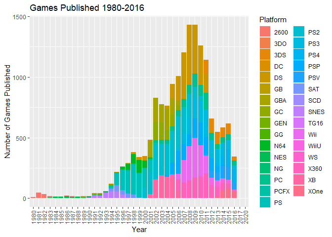
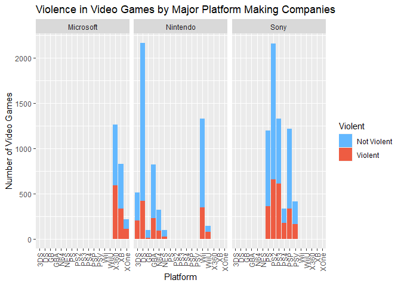
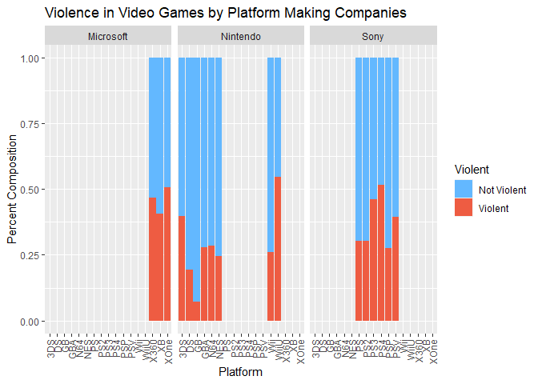

Statistical and Graphical Analysis of 1980-2016 Video Games Sales
================
Prithvi Kinariwala

  - [Introduction](#introduction)
      - [The Data](#the-data)
      - [The Tools](#the-tools)
      - [The Questions](#the-questions)
  - [Research Questions (and
    Answers\!)](#research-questions-and-answers)
      - [What years saw the greatest amount of game
        releases?](#what-years-saw-the-greatest-amount-of-game-releases)
      - [Are certain gaming platforms more violent than
        others?](#are-certain-gaming-platforms-more-violent-than-others)
  - [Conclusion](#conclusion)
  - [Limitations](#limitations)
  - [Works Cited](#works-cited)

## Introduction

Video games have become the basis of millions of childhoods across the
world. Generations can attest to ubiquitous Pacman, legendary Zelda, the
adventurous Mario Brothers, and brave Master Chief. From these legends
have arisen corporate conglomerates, cutting-edge computational power,
and a yearning fanbase.

However, what pushes some games to the top and others to crash? What
platforms are more “violent?” What region loves their sacred controllers
and game cartridges the most? Would releasing a game in North America be
more beneficial than releasing in Japan? Although these are questions of
an over-achieving gamer, the quest was to get the bottom of some of them
with R and a public dataset.

### The Data

Video games and their respective sales from 1980-2016 were analyzed to
find answers to questions regarding sales, genres, violence in video
games and regional predictions. The public data set attained from
[Kaggle](www.%20https://www.kaggle.com/gregorut/videogamesales.com)
contained:

  - Rank - Ranking of overall sales
  - Name - The games name
  - Platform - Platform of the games release (i.e. PC,PS4, etc.)
  - Year - Year of the game’s release
  - Genre - Genre of the game
  - Publisher - Publisher of the game
  - NA\_Sales - Sales in North America (in millions)
  - EU\_Sales - Sales in Europe (in millions)
  - JP\_Sales - Sales in Japan (in millions)
  - Other\_Sales - Sales in the rest of the world (in millions)
  - Global\_Sales - Total worldwide sales.

Once the data from Kaggle is downloaded, load it as a csv into RStudio.
The `file.choose()` command can be used to locate the filepath for the
file.

``` r
vgsales=read.csv("C:\\Users\\Prithvi Kinariwala\\Documents\\video-games-with-R\\vgsales.csv")
```

You’ll only need to import the data once, as we’ll copy it within the
RStudio environment for separate data wrangling.

*Keep in mind that the data is only complete from years 1980-2016. Games
marked as released past 2016 are predictions and not concrete data*

### The Tools

> “It’s dangerous to go alone\! Take this.” -Old Man, The Legend of
> Zelda

Every journey requires the right tools. For this one, the following R
libraries were used. Installations are only needed once per R
installation.

``` r
install.packages("ggplot2")
install.packages("dplyr")
install.packages("RColorBrewer")
```

Next you’ll need to “activate” the individual libraries.

``` r
library(ggplot2)
library(dplyr)
library(RColorBrewer)
```

### The Questions

Questions explored were:

1.  What years saw the greatest amount of game releases?
2.  Are certain gaming platforms more violent than others?
3.  Are shooting games more popular in America?
4.  Is PlayStation better than Xbox?
5.  Are North American or Japanese sales better at indicating how a
    video game does globally?

## Research Questions (and Answers\!)

### What years saw the greatest amount of game releases?

Since the creation of the first rudimentary Pong game, video game
development has spread across the world with demand. International
developers push out games for well-known franchises as well as iconic
standalones. Although it is safe to assume that more games are in
circulation now than at the advent of video gaming, to what extent is
this difference? When exactly were the greatest amount of video games
produced and what platform was the most popular?

The best visual would be a bar graph with the release years as the
x-axis. But first, you’ll need to clean up the data by removing games
with “N/A” as the year. We make a copy of the data and clean up the copy
only as data wrangling differs from question to question.

``` r
yeargames=vgsales
yeargames<-yeargames[!(yeargames$Year=="N/A" ),]
```

Next, use the `ggplot` library to create a graph.

``` r
ggplot(data = yeargames, mapping = aes(x =Year, fill= Platform))+
  geom_bar()+
  theme(axis.text.x=element_text(angle=90,hjust=1,vjust=0.5))+
  labs(x = "Year", y="Number of Games Published",title = "Games Published 1980-2016")
```

<!-- -->

The maximum in the timeframe with given data was 2008 and 2009. This
peak can be attributed to an overlap between the Sixth Console
Generation (1998-2013) and Seventh Console Generation (2005-present) as
well as a new demand for handheld gaming. The two years have games for
both Xbox and Xbox 360, PS2 and PS3, and handhelds like the Nintendo DS
and PSP.

The following years depict a decrease in the number of games released
mainly due to less game developers being able to create games to new
graphics specifications of Seventh Console Generation games. Effectively
put, creating games became much more intensive, with teams dedicated to
specific functions, like graphics. The change between the Seventh
Console Generation and Eighth Console Generation should portray the
same, as seen with the drop in games in 2012-2016. In summary, as
platforms become more powerful, less game studios can create games that
use the full technical capacity desired by consumers.

### Are certain gaming platforms more violent than others?

Video game platforms, like video games, have target audiences. This
audience targeting is often done with the creation and release of video
games exclusive to certain platforms as well as establishing
developmental tools and game engines that certain genres lend themselves
well to. Mario Kart’s players will never throw shells on non-Nintendo
platforms, Microsoft won’t let Master Chief save the UNSC on a
PlayStation, nor is Uncharted leaving Sony’s tight grasp.

Game developers use hardware differences to create unique games for
respective platforms. Nintendo’s origins have naturally evolved into
platform games with Nintendo originals being the most popular. Games
like Mario Kart, Mario Party, Super Smash Bros., and Wii Sports series
are Nintendo’s incentives for buying it’s consoles. On the other hand,
action, shooter, and fighting games like the Halo, *mostly* Call of
Duty, and Grand Theft Auto series are only offered on Xbox and
PlayStation consoles. Thus, the *assumptions* made by critics attribute
the Xbox and PlayStation to being more violent than their Nintendo
counterparts.

*Sidenote: Although Nintendo has recently released the Switch, the
company has pushed games similar to its older generations. Due to its
recent release and a lack of data, the Switch was not considered for the
report.*

To tackle the question, a graphical analysis alongside population
parameters would be sufficient. The action, shooter, and fighting genres
were determined to be “violent” while all other genres were determined
“not violent.” Counts and percentages should be analyzed to find
platforms more violent than others.

Before generating the graphs, we need to add two more character vectors
(columns) to the data. One for the major platform brand (Microsoft,
Nintendo, Sony) and one to classify genres as violent or not. Like the
first question, we create a copy of the first data set to create a
unique data set after wrangling. Then, each new vector starts out empty
at `NULL` before the for-loop iterates each row while determining each
row.

``` r
violentgames=vgsales

# For-loop to classify certain genres as Violent and others as Non-violent
Violent = NULL
for(i in 1:nrow(violentgames))
{
    if(violentgames[i,5]=="Action"|violentgames[i,5]=="Fighting"|violentgames[i,5]=="Shooter" ){Violent[i]<-"Violent"}
    else{Violent[i]<-"Not Violent"}
}

# For-loop to classify platforms by platform manufacterers 
ConsoleMaker = NULL
for(i in 1:nrow(violentgames))
{
  if(violentgames[i,3]=="DS"|violentgames[i,3]=="3DS"|violentgames[i,3]=="GB"|violentgames[i,3]=="GBA"|violentgames[i,3]=="N64"|violentgames[i,3]=="NES"|violentgames[i,3]=="Wii"|violentgames[i,3]=="WiiU"){ConsoleMaker[i]<-"Nintendo"}
  else if(violentgames[i,3]=="PS"|violentgames[i,3]=="PS2"|violentgames[i,3]=="PS3"|violentgames[i,3]=="PS4"|violentgames[i,3]=="PSP"|violentgames[i,3]=="PSV"){ConsoleMaker[i]<-"Sony"}
  else if(violentgames[i,3]=="X360"|violentgames[i,3]=="XB"|violentgames[i,3]=="XOne"){ConsoleMaker[i]<-"Microsoft"}
  else{violentgames[-i]}
}
```

Finally, we bind the seperate vectors with the video games data and
remove any lingering “N/A”s.

``` r
violentData=cbind(violentgames,Violent,ConsoleMaker)
violentData <- na.omit(violentData)
```

Now that we have prepared the data, we can finally start graphing\! The
first graph is a simple game count by platform split between violent and
non-violent games. A stacked bar graph is perfect on illustrating many
properties at once.

``` r
ggplot(data = violentData, mapping = aes(x =Platform,fill= Violent)) + 
  geom_bar()+facet_wrap(~ConsoleMaker)+
  labs(y="Number of Video Games",title = "Violence in Video Games by Major Platform Making Companies")+
  theme(axis.text.x=element_text(angle=90,hjust=1,vjust=0.5))+scale_fill_manual(values = c("steelblue1","tomato2"))
```

<!-- -->

Let’s get a percent bar graph to get another insight\! Mind that
less-popular platforms will have their differences blown out of
proportion *cough cough Wii U*.

``` r
ggplot(data = violentData, mapping = aes(x =Platform,fill= Violent))+ 
  geom_bar(position="fill")+facet_wrap(~ConsoleMaker)+
  labs(y="Percent Composition",title = "Violence in Video Games by Platform Making Companies")+
  theme(axis.text.x=element_text(angle=90,hjust=1,vjust=0.5))+scale_fill_manual(values = c("steelblue1","tomato2"))
```

<!-- -->

Although you should be able to see visual differences between the three
major brands, the last metric to answer the question would be the
population parameters themselves. We can use the `dplyr` package to
create two-way table commands to give us counts that can be used to find
the parameters.

``` r
violence_two_way_table <- violentData %>%
  group_by(ConsoleMaker, Violent) %>% 
  summarize(count = n())
violence_two_way_table
```

    ## # A tibble: 6 x 3
    ## # Groups:   ConsoleMaker [3]
    ##   ConsoleMaker Violent     count
    ##   <fct>        <fct>       <int>
    ## 1 Microsoft    Not Violent  1267
    ## 2 Microsoft    Violent      1035
    ## 3 Nintendo     Not Violent  4077
    ## 4 Nintendo     Violent      1400
    ## 5 Sony         Not Violent  4348
    ## 6 Sony         Violent      2300

From these numbers, we find the proportions with one of the most basic
functions of R, it’s calculator\!

``` r
# Microsoft Platform Violent Games Proportion
1035/(1035+1267)
```

    ## [1] 0.449609

``` r
# Nintendo Platform Violent Games Proportion
1400/(1400+4077)
```

    ## [1] 0.2556144

``` r
# Sony Platform Violent Games Proportion
2300/(2300+4348)
```

    ## [1] 0.3459687

The figures show that the Xbox 360 has more violent games than any
Nintendo platform. The same relationship is true of PlayStation 2 and
PlayStation 3 over the Nintendo Platform as well. This relationship is
further seen in the percent bar graphs, where WiiU’s data is skewed only
due to considerably less games being created for its platform before
being discontinued. After using the dplyr two-way-table function to
create a list of violent and nonviolent counts by platform company,
Microsoft had the greatest percent of violent games (44.96%) followed by
Sony (34.60%) and lastly Nintendo (25.56%). The data indicates that
Nintendo platforms tend to be less violent than Microsoft and Sony
platforms.

Does this mean you should never buy your child a Xbox or PlayStation?
**No.** My first game was Halo 2 with the family, and I turned out
alright.

## Conclusion

> “The numbers, Mason\! What do they mean?” -Jason Hudson, Call of Duty:
> Black Ops

## Limitations

The dataset didn’t contain information on games released for the year
2017 and after. Despite there not being too many major changes to the
gaming industry since that year, the composition of game genres and mean
sales may be different if this data was included. Furthermore, it would
paint a more recent picture of the data and the conclusions. We may see
a greater increase in the sales for the Shooting games genre as the
years progress. Genres themselves were a bit too broad. The “Fighting”
genre encompassed both the gory Mortal Kombat series as well as the
child-oriented Super Smash Bros. series. Many dates were also missing.
Furthermore, we may also see a greater increase in the number of Xbox
games that could begin to rival that of the PlayStation in recent times.
There are many more indicators that make one console better than the
other, such as specifications, compatibility with new releases, user
experience ratings, etc. which we did not cover and could better answer
the question of comparing Xbox and PlayStation.

## Works Cited
